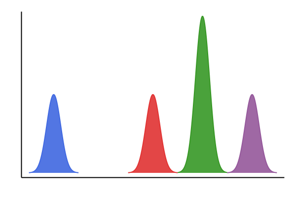

[](https://travis-ci.org/ajgiuliani/MSj.jl)
[](https://coveralls.io/github/ajgiuliani/MSj.jl?branch=master)
[](https://codecov.io/gh/ajgiuliani/MSj.jl)
[](https://ajgiuliani.github.io/MSj.jl/stable)
[](https://ajgiuliani.github.io/MSj.jl/dev/)


<p align="center">
  <h1 align="center"> MS<sup>j</sup>.jl  </h1>
</p>

<p align="center">
  
</p>
<p align="center">
  <normal> A mass spectrometry package for Julia </normal>
</p>

-----


## Installation
This package is unregistered. It can be installed either with the Julia package manager.
From the Julia REPL, type `]` to enter the Pkg REPL mode and run:
```julia
(v1.3) pkg> add https://github.com/ajgiuliani/MSj.jl
```
or using the package API:

```julia
using Pkg
Pkg.add(PackageSpec(url="https://github.com/ajgiuliani/MSj.jl"))
```

## Documentation
Documentation is available [here](https://ajgiuliani.github.io/MSj.jl/stable).


## Usage
MS<sup>j</sup> is a package for loading, processing and plotting mass spectrometry data. It provides the following functionalities:

    Getting information on the file
    Load a file
    Averaging mass spectra based on various criteria that may be combined
    Chromatogram and extracted chromatograms
    Processing the data
        smoothing
        baseline correction
        peak-picking
    Calculation of isotopic distribution

To get information on a file:
```julia
info("path/to/file")
```

Mass spectra can be loaded by:
```julia
data = load("path/to/file")
```

And averaged as follow:
```julia
ms1 = average(data, MSj.Level(1))                   # full MS scans
ms2 = average(data, MSj.Level(2))                   # MS2 spectra
ms3 = average(data, MSj.Activation_Method("CID"))   # CID spectra
```

See the [documentation](https://ajgiuliani.github.io/MSj.jl/stable) for additional information.

## Supported file format
* mzxml

## Other Julia packages
* [mzXML](https://github.com/timholy/mzXML.jl): Load mass spectrometry mzXML files.
* [MassSpec.jl](https://github.com/JuliaSpect/MassSpec.jl): Mass spectometry utilities for Julia
